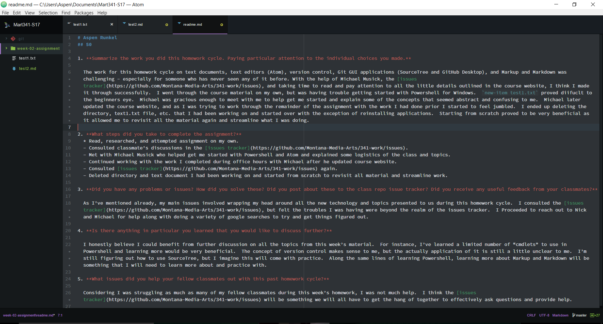

# Aspen Runkel
## 50

1. **Summarize the work you did this homework cycle. Paying particular attention to the individual choices you made.**

  The work for this homework cycle on text documents, text editors (Atom), version control, Git GUI applications (SourceTree and GitHub Desktop), and Markup and Markdown was challenging - especially for someone who has never seen any of it before. With the help of Michael Musick, the [issues tracker](https://github.com/Montana-Media-Arts/341-work/issues), and taking time to read and pay attention to all the little details outlined in the course website, I think I made it through successfully.  I went through the course material on my own, but was having trouble getting started with Powershell for Windows.  `new-item test1.txt` proved diifuclt to the beginners eye.  Michael was gracious enough to meet with me to help get me started and explain some of the concepts that seemed abstract and confusing to me.  Michael later updated the course website, and as I was trying to work through the remainder of the assignment with the work I had done prior I started to feel jumbled.  I ended up deleting the directory, text1.txt file, etc. that I had been working on and started over with the exception of reinstalling applications.  Starting from scratch proved to be very beneficial as it allowed me to revisit all the material again and streamline what I was doing.

2. **What steps did you take to complete the assignment?**
  * Read, researched, and attempted assignment on my own.
  - Consulted classmate’s discussions in the [issues tracker](https://github.com/Montana-Media-Arts/341-work/issues).
  - Met with Michael Musick who helped get me started with Powershell and Atom and explained some logistics of the class and topics.
  - Continued working with the work I completed during office hours with Michael after he updated course website.
  - Consulted [issues tracker](https://github.com/Montana-Media-Arts/341-work/issues) again.
  - Deleted directory and text document I had been working on and started from scratch to revisit all material and streamline work.

3. **Did you have any problems or issues? How did you solve these? Did you post about these to the class repo issue tracker? Did you receive any useful feedback from your classmates?**

  As I’ve mentioned already, my main issues involved wrapping my head around all the new technology and topics presented to us during this homework cycle.  I consulted the [issues tracker](https://github.com/Montana-Media-Arts/341-work/issues), but felt the troubles I was having were beyond the realm of the issues tracker.  I Proceeded to reach out to Nick and Michael for help along with doing a variety of google searches to try and get things figured out.

4. **Is there anything in particular you learned that you would like to discuss further?**

  I honestly believe I could benefit from further discussion on all the topics from this week’s material.  For instance, I’ve learned a limited number of “cmdlets” to use in Powershell and learning more would be very beneficial.  The concept of version control makes sense to me, but the actually application of it is still a little unclear to me.  I’m still figuring out how to use SourceTree, but I imagine this will come with practice.  Along the same lines of learning Powershell, learning more about Markup and Markdown will be something that I will need to learn more about and practice with.

5. **What issues did you help your fellow classmates out with this past homework cycle?**

  Considering I was struggling as much as many of my fellow classmates during this week’s homework, I was not much help.  I think the [issues tracker](https://github.com/Montana-Media-Arts/341-work/issues) will be something we will all have to get the hang of together to effectively ask questions and provide help.

  
