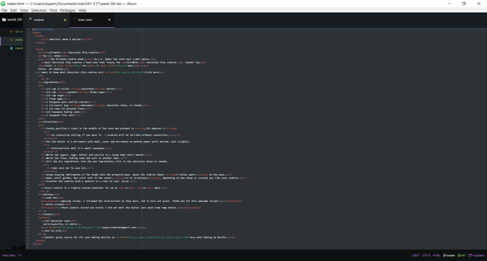
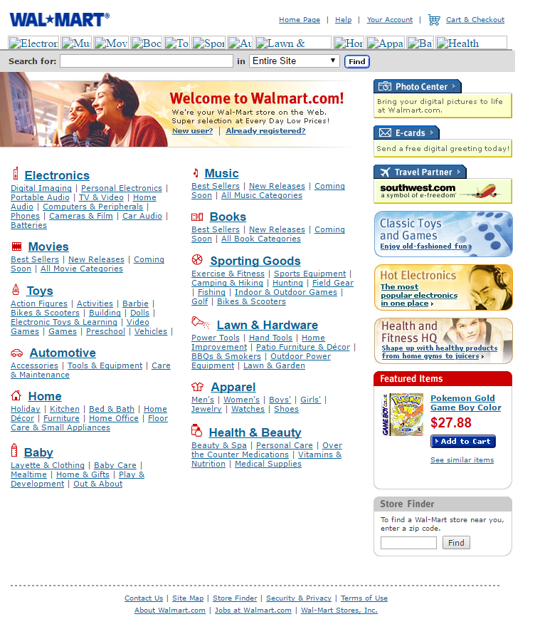
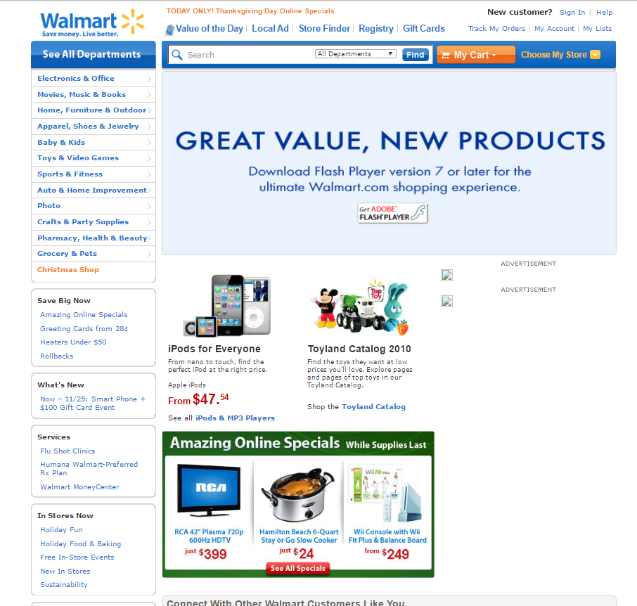
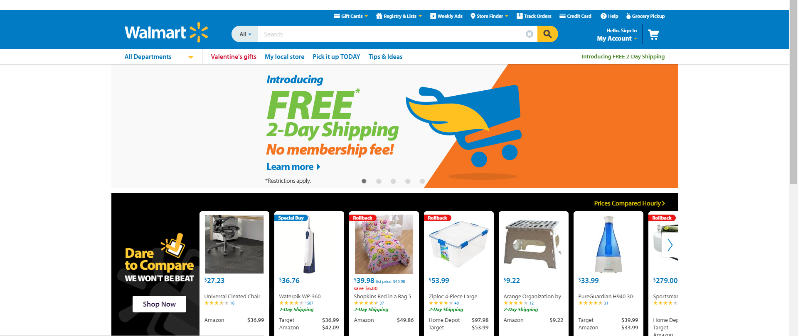
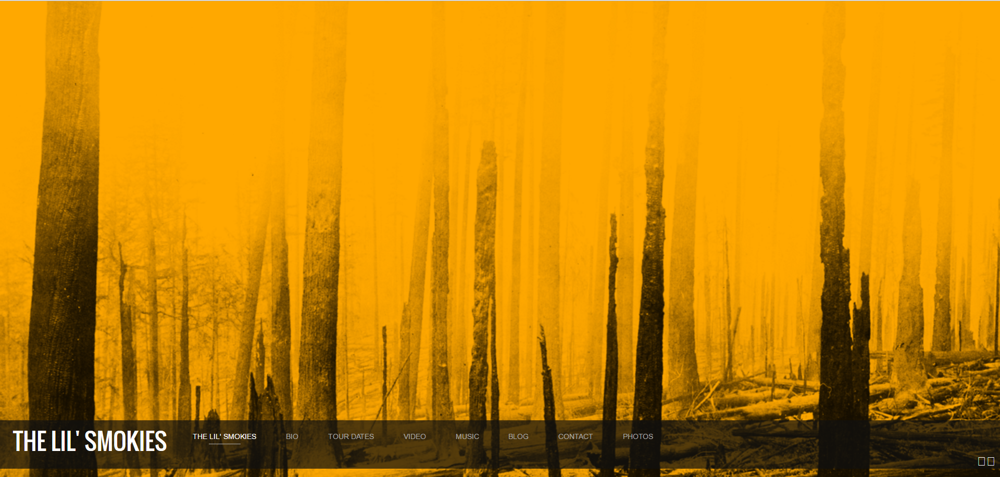
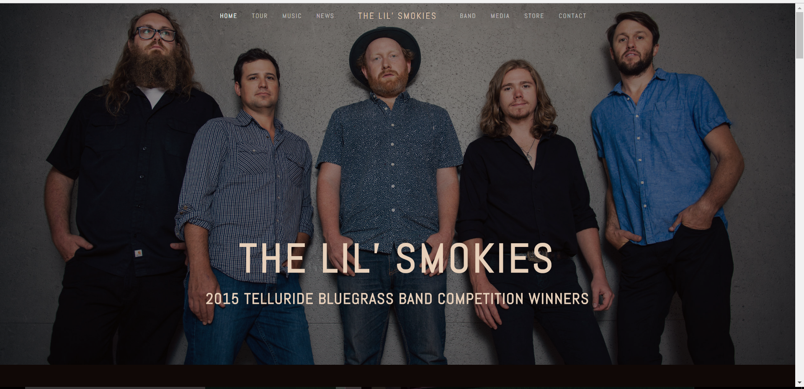

# Aspen Runkel
## 50

1. **Overview of Process**
 Spending this last week learning about additional HTML elements was very useful and is helping me become more comfortable with creating and reading HTML.  Creating my recipe html turned out to be pretty time consuming, but the HTML itself is pretty straightforward and coming along nicely.
After settling on a recipe, I began by laying out the basic structure introduced in "Week 3" and gradually worked through the requirements for the file including:
  - ordered and/or unordered lists *with* nesting
  - definition list
  - semantic markup (**bold/strong**, *italic/emphasis*, block quotations, "quotations", abbreviations, citations, addresses, <ins>insert</ins> & <del>delete</del>, and <s>strike through</s>)
  - Hyperlinks
  - E-mail links

  I like the combination of the course content and the HTML&CSS textbook by Duckett.  The reinforce eachother and make the seemingly complicated HTML inviting and digestable.
When I initially considered my index.html complete, I tested it in a browser and the links I created did not work.  After some adjusting with the aid of both of these resources, I was able to complete a fully functioning page.
 
2.  **Wayback Machine**
I thought the Wayback Machine was really interesting. I looked at Walmart.com to start with.
2000
2010
2017
There was a HUGE difference between 2000 and 2010, but less so between 2010 and the present.

Another site I looked is a band that I made an event poster for in another class called *The Lil' Smokies*.  
Their first online presence in 2014 is acceptable. 
But their current website is much more personalized and representative. 
3.  **Concluding Thoughts**
Overall, this homework cycle was tedious, but rewarding.  I'm really starting to get the hang of HTML without constantly having to reference sources which makes the work flow much better.
