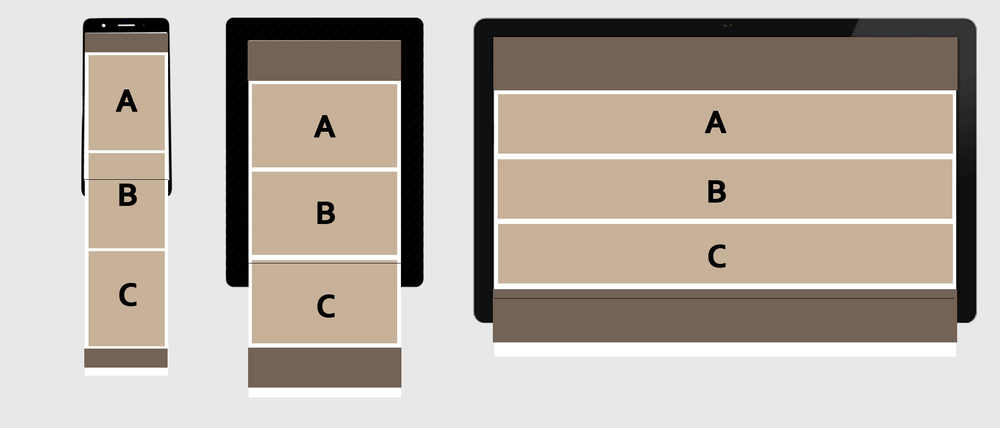

<h1>Aspen Runkel</h1> 
<h2>Section 50</h2>

<h3>Step 1: Content</h3>
1. <strong>What is the information my site aims to deliver?</strong>  
My site aims to explain what responsive website design is, why it is important, and how to test it for other devices. 
 
2. <strong>What is the first information on the page that should draw the eye?</strong> 
The Title of the website and prompted questions regarding responsive website design should draw the eye and direct the user. 
 
3. <strong>What is the primary content of this page?</strong> 
The primary content of this webpage is the explanation answering what responsive web design is.  This is why it is the first question and answer listed on the page. 
 
4. <strong>What is the secondary content?</strong> 
The secondary content are the 2nd and 3rd questions with their corresponding explanations. 
 
5. <strong>Font and color choices</strong> 
I choose a modern font and color scheme which I felt represented the topic of responsive web design.  It is clean, easy to read, and complementary. 
 

<h3>Step 2: Sketch and Wireframes</h3>
6. <strong>Mobile sketch, Medium sketch, and Computer sketch</strong> 
 
 

<h3>Conclusion</h3>
7.  Overall, the work this homework cycle induced more thought regarding content creation and helped me think about what responsive web design is and why it is important.  The webpage I created is pretty basic, but it utilizes much of the concepts and strategies to utilized in responsive web design.
